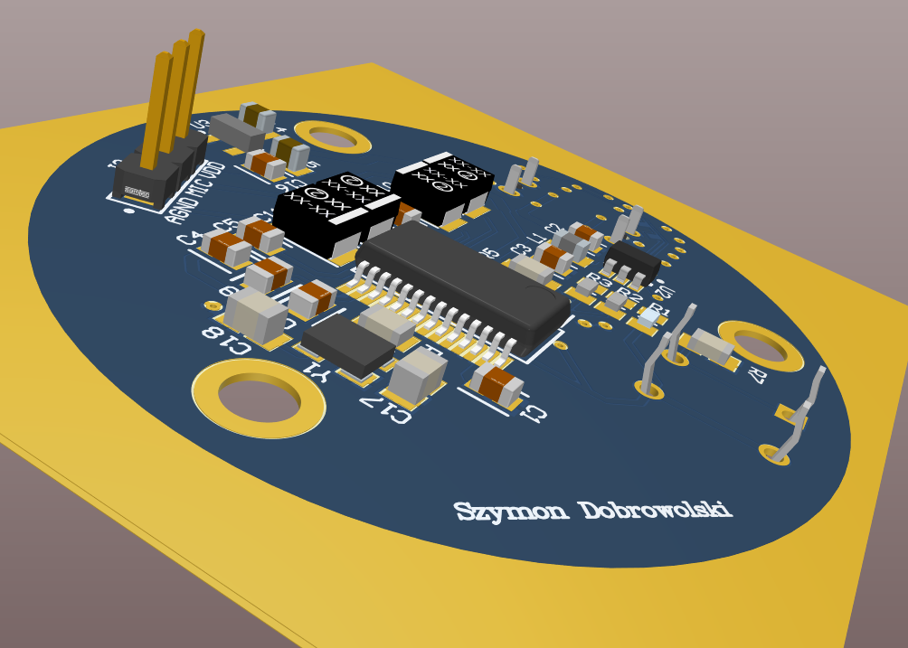
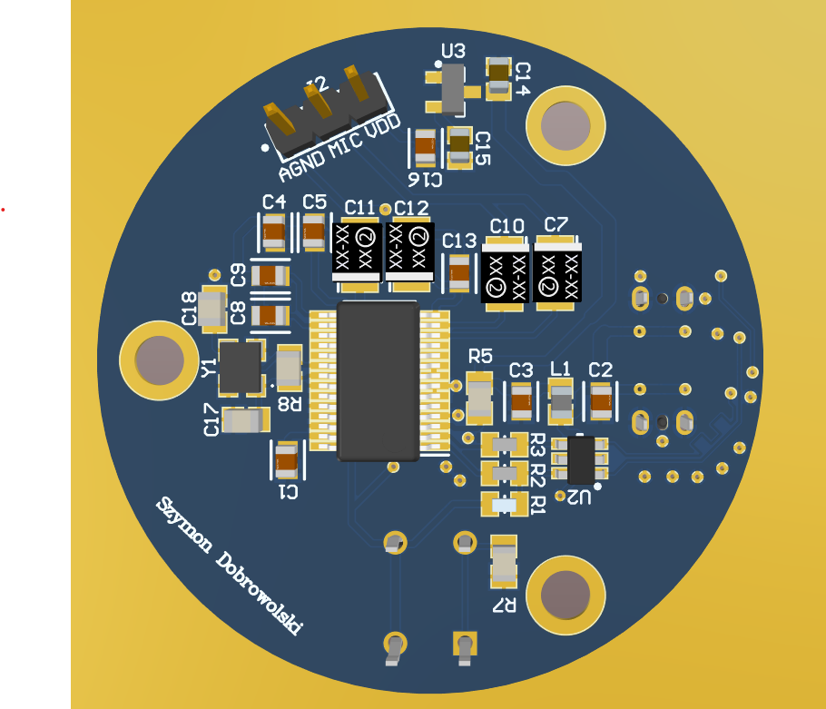
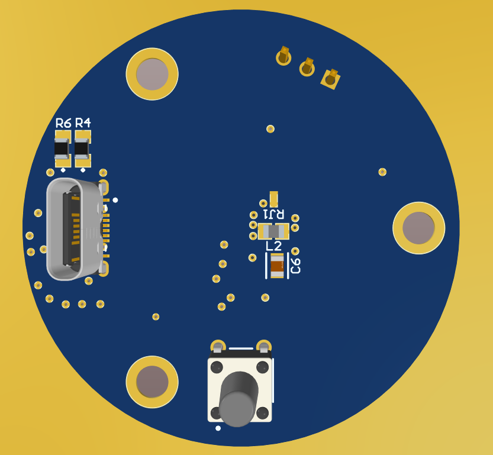
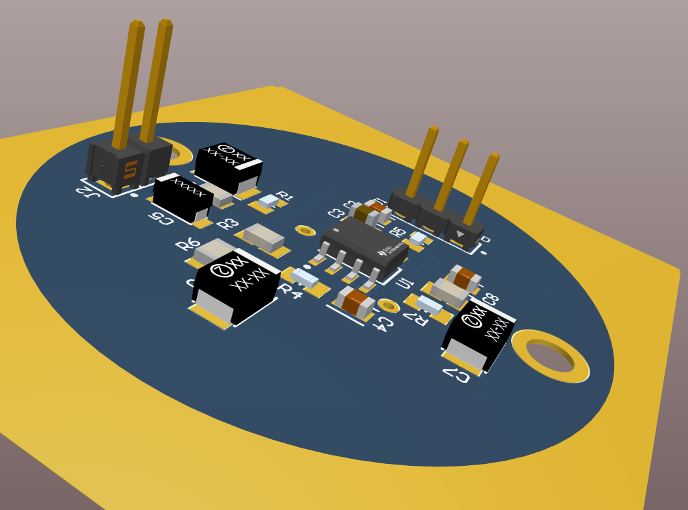

# High-Fidelity DIY USB Microphone 🎙️

Welcome to the **High-Fidelity DIY USB Microphone** project repository! This project features a custom-designed, two-board USB audio interface and microphone preamplifier built from scratch. The primary goal of this project was to achieve a studio-grade noise floor (-90 dB to -100 dB) using carefully selected components and advanced mixed-signal PCB design techniques.

## 🌟 Key Features
* **Ultra-Low Noise Floor:** Achieved ~ -90dB to -100dB noise floor in the mid/high frequencies thanks to strict analog/digital isolation.
* **Dual-Board Design:** Separates the noisy USB/Digital section (Main Board) from the highly sensitive analog preamplifier (Amp Board).
* **Advanced Power Filtering:** Features a $\pi$ (Pi) filter on the USB VBUS and a dedicated 3.3V LDO (MCP1700) with optimized decoupling.
* **Isolated PLL Power:** The internal clock of the audio codec is powered through a dedicated ferrite bead to prevent digital noise from bleeding into the audio path.
* **Star Grounding:** Strict separation of Digital GND and Analog GND (AGNDC), tied together at a single point to eliminate ground loops.
* **Premium Analog Front-End:** Utilizes the ultra-low noise **OPA1688** operational amplifier and supports high-end electret capsules like the **AOM-5024L**.

---

## 📊 Performance & Measurements
The circuit has been tested and analyzed to ensure the absence of USB digital noise, high-frequency coil whine, and ground loops. The spectral analysis of the raw audio output (silence/ambient room noise) yielded outstanding results.

* **Low Frequencies (50 Hz - 150 Hz):** ~ -50 dB to -60 dB *(Represents natural room ambient noise, e.g., PC fans. No 50Hz mains hum detected).*
* **Mid Frequencies (1 kHz - 5 kHz):** -78 dB dropping to -94 dB *(The most sensitive range for human hearing is completely free of digital artifacts).*
* **High Frequencies (10 kHz - 20 kHz):** **-96 dB to -100 dB** *(Perfect isolation of the 12MHz crystal and PLL clock; no high-frequency interference bleeds into the audio path).*

*Tip: The extreme cleanliness of the upper spectrum proves the effectiveness of the Pi filter and the isolated analog ground plane (AGNDC).*

---

## ⚙️ Hardware Architecture

### 1. Main Board (USB Codec)
The main board handles USB communication, digital-to-analog/analog-to-digital conversion, and power regulation.

  
  

* **Audio Codec:** Texas Instruments **PCM2906C** (16-bit, 48kHz).
* **Connector:** USB Type-C.
* **Power Supply:** 5V to 3.3V conversion via **MCP1700** LDO.
* **Design Highlights:** Unused analog outputs are AC-coupled to ground to prevent oscillation. The highly sensitive `VCOM` pin is routed with priority and shielded with a solid analog ground plane.

### 2. Amp Board (Microphone Preamplifier)
The small, circular board is designed to be housed directly behind the microphone capsule.

* **Op-Amp:** Texas Instruments **OPA1688** configured with optimal gain (33 kΩ feedback resistor).
* **Input Filtering:** Features an RC filter on the microphone bias and an RF low-pass filter (100 Ω + 100 pF C0G capacitor) on the op-amp input to reject electromagnetic interference.
* **Coupling:** High-quality capacitors block DC offset while preserving low-frequency bass response.

---

## 📂 Repository Structure

* `3D_images/` - 3D renders of the PCBs and the microphone housing.
* `_Previews/` - Image previews of the board layouts and schematics.
* `Project Logs...` & `Project Outputs...` - Altium Designer generation folders.
* `Main_board_schematic.pdf` - PDF schematic of the USB Codec board.
* `Amp_board_schematic.pdf` - PDF schematic of the Preamplifier board.
* `Main_gerber_files.zip` - Production-ready Gerber and NC Drill files for the Main Board.
* `Amp_gerber_files.zip` - Production-ready Gerber and NC Drill files for the Amp Board.
* `*.SchDoc`, `*.PcbDoc`, `*.PrjPcb` - Source design files created in **Altium Designer**.

## 🛠️ Fabrication & Assembly
This project is fully ready for fabrication. You can directly upload the `Main_gerber_files.zip` and `Amp_gerber_files.zip` to your preferred PCB manufacturer (e.g., JLCPCB, PCBWay). 
* **Component Footprints:** Mostly **0805** imperial code for easy hand-soldering.
* **Critical Components:** Ensure that C0G/NP0 dielectrics are used for pF-range capacitors in the audio path, and X7R/X5R for decoupling.

## 📝 License
Feel free to explore, clone, and modify this project for your own DIY audio interfaces!
