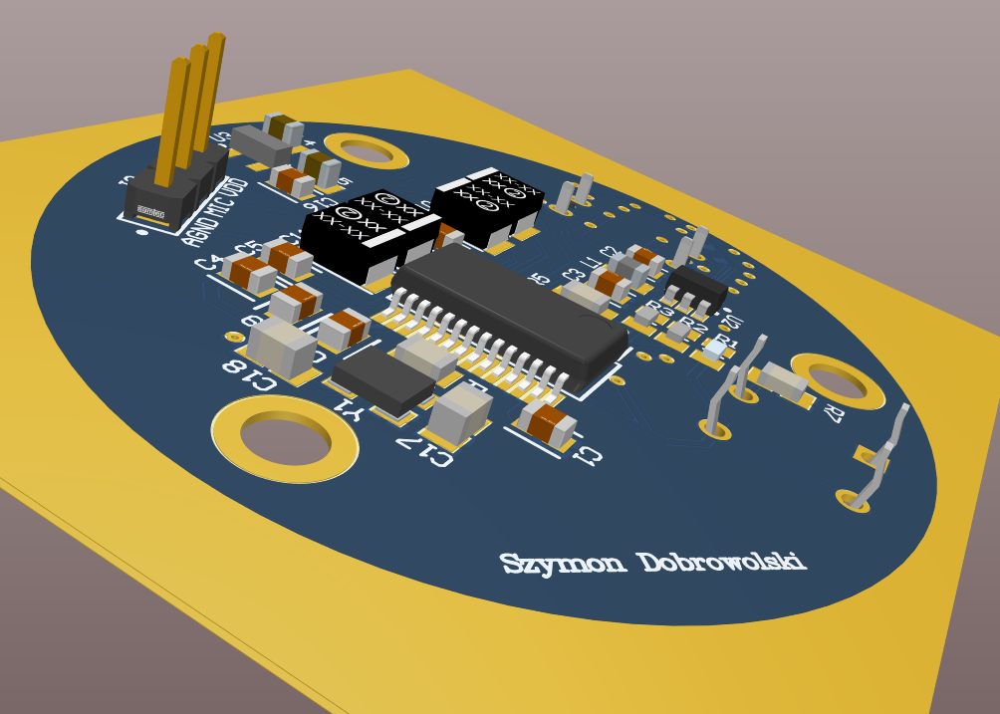
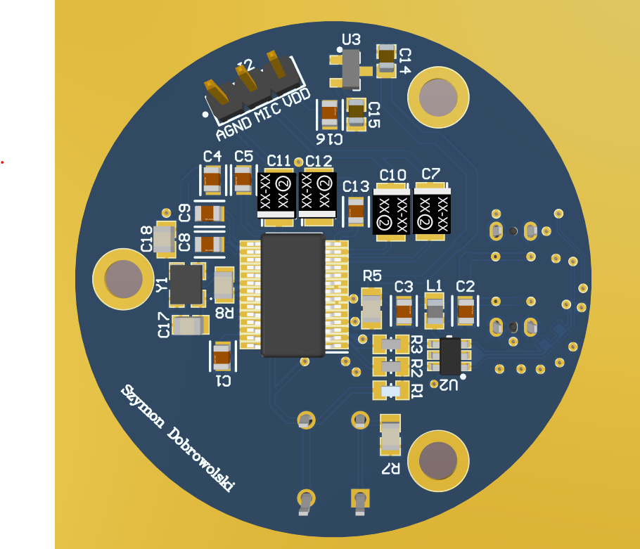
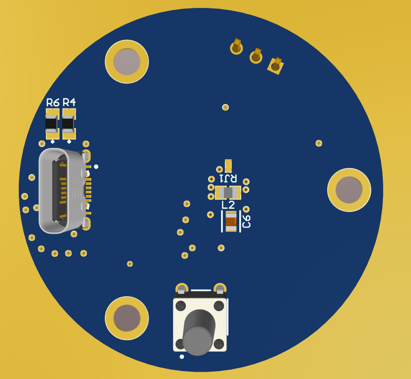
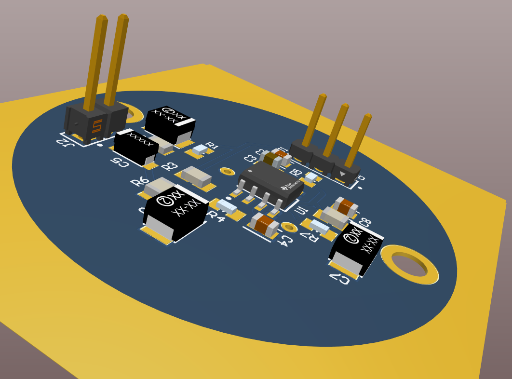
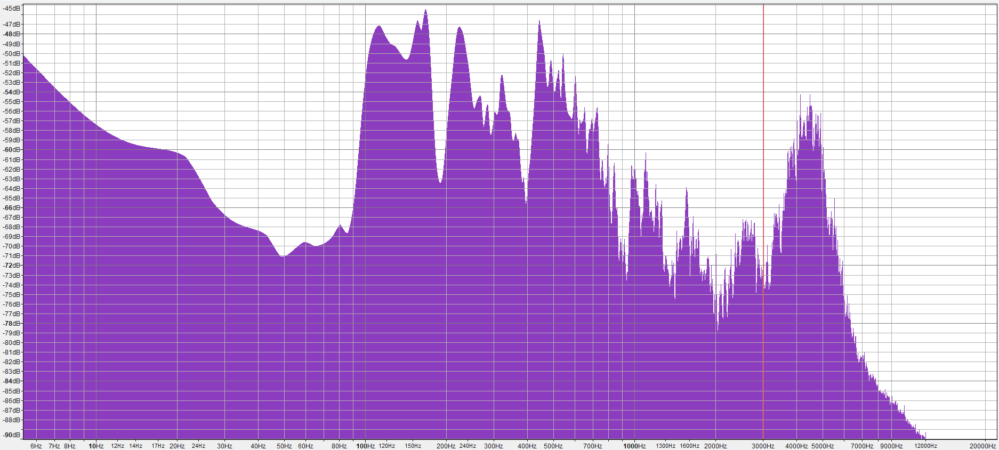
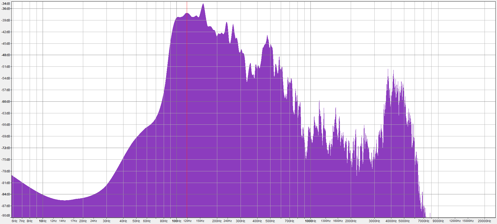
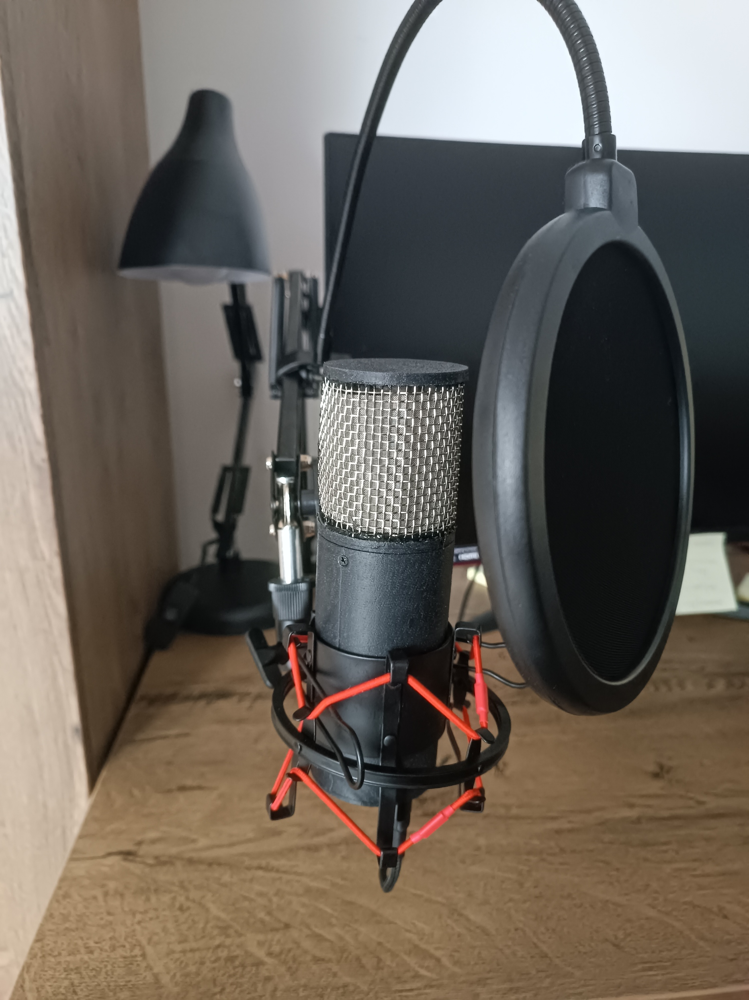
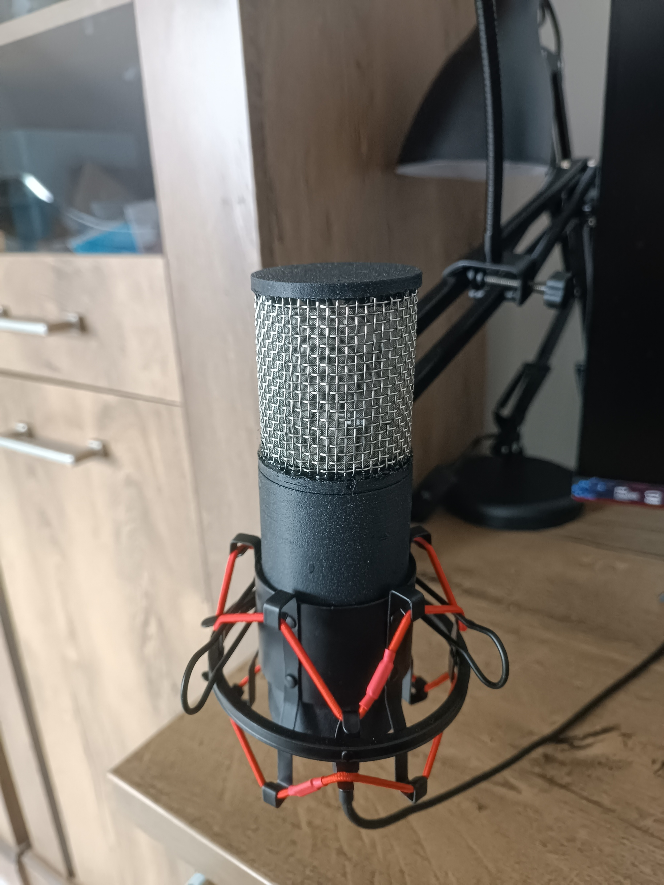

# High-Fidelity DIY USB Microphone 🎙️

 

Welcome to the **High-Fidelity DIY USB Microphone** project repository! This project features a custom-designed, two-board USB audio interface and microphone preamplifier built from scratch. The primary goal of this project was to achieve a studio-grade vocal capture by combining a highly sensitive, interference-free custom PCB design with precise digital signal processing (DSP).

## 🌟 Key Features
* **Clean Signal Path:** Strict analog/digital isolation ensures the audio path is free from high-frequency digital bleed, coil whine, and USB packet noise.
* **Dual-Board Design:** Separates the noisy USB/Digital section (Main Board) from the highly sensitive analog preamplifier (Amp Board).
* **Advanced Power Filtering:** Features a $\pi$ (Pi) filter on the USB VBUS and a dedicated 3.3V LDO (MCP1700) with optimized decoupling.
* **Premium Analog Front-End:** Utilizes the ultra-low noise **OPA1688** operational amplifier to unleash the full dynamic range of high-end electret capsules like the **Primo AOM-5024L**.
* **Custom Acoustic Housing:** 3D-printed enclosure optimized for shock mounting and pop-filter integration to eliminate mechanical noise and plosives.
* **DSP Tuned:** Because the custom hardware captures the acoustic reality of the room with extreme sensitivity, precise real-time tuning (via SteelSeries Sonar) is applied to achieve a flawless broadcast character.

---

## ⚙️ Hardware Architecture

### 1. Main Board (USB Codec)
The main board handles USB communication, digital-to-analog/analog-to-digital conversion, and power regulation.

  
  

* **Audio Codec:** Texas Instruments **PCM2906C** (16-bit, 48kHz).
* **Connector:** USB Type-C.
* **Power Supply:** 5V to 3.3V conversion via **MCP1700** LDO.
* **Design Highlights:** Unused analog outputs are AC-coupled to ground to prevent oscillation. The highly sensitive `VCOM` pin is routed with priority and shielded with a solid analog ground plane.

### 2. Amp Board (Microphone Preamplifier)
The small, circular board is designed to be housed directly behind the microphone capsule.

* **Op-Amp:** Texas Instruments **OPA1688** configured with optimal gain (33 kΩ feedback resistor).
* **Input Filtering:** Features an RC filter on the microphone bias and an RF low-pass filter (100 Ω + 100 pF C0G capacitor) on the op-amp input to reject electromagnetic interference.
* **Coupling:** High-quality capacitors block DC offset while preserving low-frequency bass response.

### 3. Custom 3D-Printed Housing & Acoustics
To protect the sensitive electronics and ensure optimal acoustic performance, a dedicated housing was designed.
* **Acoustic Transparency:** The headbasket design allows sound waves to reach the capsule directly without causing unwanted internal reflections.
* **Vibration Isolation:** The enclosure is fully compatible with standard shock mounts to decouple the microphone from desk vibrations.
* **Plosive Control:** Designed to be used in tandem with an external pop filter, maintaining a minimum 5cm distance to effectively eliminate "P" and "B" wind blasts.

---

## 🎙️ Software Processing & DSP

While the custom hardware provides a high-gain, uncolored raw signal, the final "studio broadcast" character is achieved through digital processing.

**SteelSeries Sonar Configuration applied in this project:**
* **Base Preset:** "Deep Voice" for a warm, rich proximity effect.
* **ClearCast AI Noise Cancellation:** Set to ~65% to surgically remove any residual room noise without degrading vocal quality.
* **Smart Volume (Compressor):** Enabled to ensure a consistent, powerful, and professional output level regardless of speaking distance (optimal distance tested: ~20cm).

---

## 📊 Performance & Measurements

The circuit has been rigorously tested to ensure the absence of USB digital noise, high-frequency coil whine, and ground loops. 

### Spectrum Analysis (Vocal Performance & DSP)

The spectral analysis below demonstrates the frequency response of a recorded voice ("Harvard Sentences" test), showcasing the striking difference between the raw hardware output and the Sonar-processed signal. 

#### Raw vs. Processed Spectrum Comparison

* **Low-End (Below 90 Hz):** The highly sensitive capsule captures real room acoustics. The raw spectrum displays significant sub-bass rumble and room noise. In the processed spectrum, the 90Hz High-Pass Filter (HPF) successfully eliminates this useless acoustic noise, keeping the vocal fundamental incredibly clean.
* **Mid-Range (100 Hz - 500 Hz):** The raw signal features jagged, resonant peaks which typically cause a "boxy" or muddy sound in untreated rooms. The processed spectrum smooths this area out, maintaining a strong, warm fundamental vocal presence (peaking smoothly around 120-150Hz) while aggressively taming the muddy frequencies (280Hz cut).
* **High Frequencies & Sibilance (4 kHz - 8 kHz):** The raw spectrum has uncontrolled, harsh spikes in the sibilance range. The processed spectrum shows a much more controlled high-end, featuring a surgical roll-off and notch after 6-7 kHz to eliminate harsh "S" and "SH" sounds without losing vocal presence.

### Audio Samples (Raw vs. Processed)
Listen to the difference between the unprocessed signal and the final DSP-tuned output. The combination of the clean AOM-5024L hardware capture and DSP tuning produces a premium broadcast sound.

| Version | Description | Audio Player |
| :--- | :--- | :--- |
| **Raw Input** | Direct signal from the PCB | [sample_raw.mp3](https://github.com/user-attachments/files/27631429/sample_raw.mp3) |
| **Processed** | Final output with DSP | [sample_processed.mp3](https://github.com/user-attachments/files/27631450/sample_processed.mp3) |

---

## 📸 Final Project Showcase

Here is how the final, fully assembled DIY High-Fidelity Microphone looks in a real desktop environment:

  
  

*(The setup includes the custom 3D-printed body, an external shock mount, and a pop-filter positioned for optimal off-axis rejection).*

---

## 📂 Repository Structure

* `3D_images/` - 3D renders of the PCBs and the microphone housing.
* `Pictures/` - Final build photos and spectrum analysis charts.
* `Samples/` - Audio test recordings (Raw and Processed).
* `_Previews/` - Image previews of the board layouts and schematics.
* `Project Logs...` & `Project Outputs...` - Altium Designer generation folders.
* `Main_board_schematic.pdf` & `Amp_board_schematic.pdf` - PDF schematics.
* `Main_gerber_files.zip` & `Amp_gerber_files.zip` - Production-ready Gerber and NC Drill files.
* `*.SchDoc`, `*.PcbDoc`, `*.PrjPcb` - Source design files (Altium Designer).

## 🛠️ Fabrication & Assembly
This project is fully ready for fabrication. You can directly upload the `.zip` Gerber files to your preferred PCB manufacturer. 
* **Component Footprints:** Mostly **0805** imperial code for easy hand-soldering.
* **Critical Components:** Ensure that C0G/NP0 dielectrics are used for pF-range capacitors in the audio path, and X7R/X5R for decoupling.

## 📝 License
Feel free to explore, clone, and modify this project for your own DIY audio interfaces!
